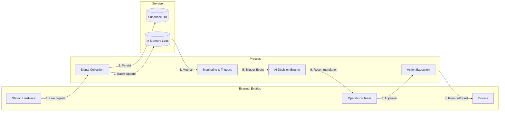
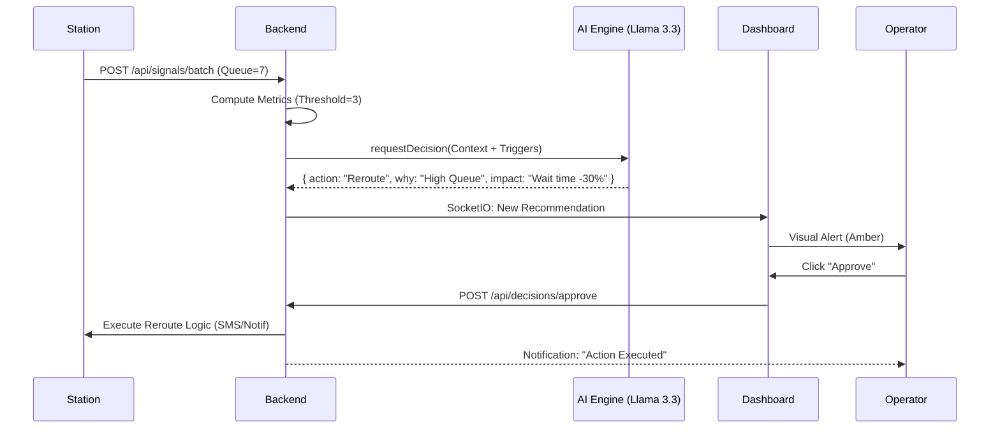
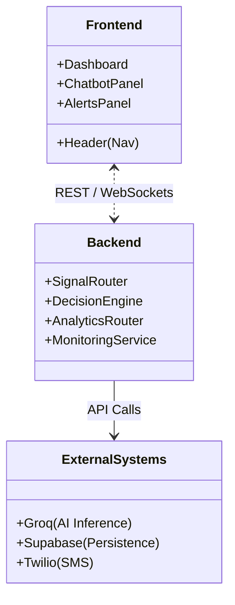
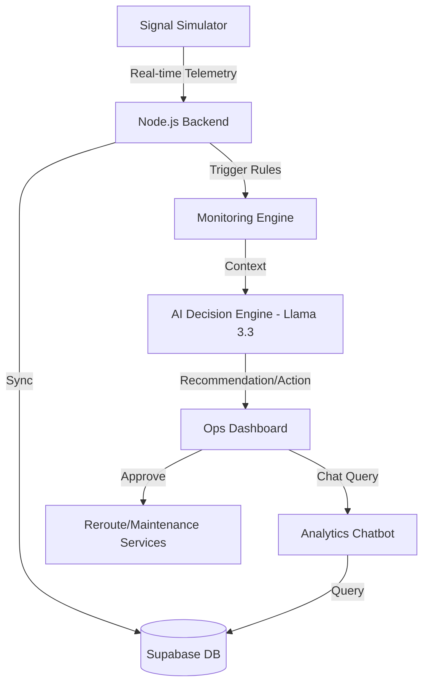

# StationOS: Agentic AI Operations Copilot for EV Swap Networks

**StationOS** is a next-generation "Operations Brain" designed to manage high-scale EV battery swapping networks. It transforms raw telemetry data from thousands of stations into autonomous actions, reducing congestion and downtime through an Agentic AI loop.

---

## ⚡ The Problem Statement
As EV adoption scales, the complexity of managing battery swap stations grows exponentially. Manual monitoring leads to:
- **Station Congestion**: Drivers waiting at busy hubs while nearby stations sit empty.
- **Stockout Events**: Running out of charged batteries during peak hours.
- **Reactive Maintenance**: Fixing chargers only *after* they fail, leading to significant downtime.

## 🚀 The USP (Unique Selling Proposition)
> **"Turning Data into Decisions, not just Dashboards."**

Unlike traditional monitoring tools, StationOS is **Agentic**. It doesn't just show you a red bar; it understands the *context*, predicts the *impact*, and **executes** the solution.

1. **Closed-Loop Autonomy**: Features a "Conservative vs. Aggressive" mode switch, allowing the system to either request approval or act autonomously.
2. **Explainable AI (XAI)**: Every recommendation includes a breakdown of *Why* it was made, the *Expected Impact*, and a *Confidence Score*.
3. **Conversational Analytics**: An integrated AI Chatbot (Llama 3.3) that has full access to real-time system state and historical Supabase data.

---

## 🏗️ Technical Architecture & Diagrams

### 1. Data Flow Diagram (DFD Level 1)
Shows the movement of telemetry data from station hardware to operational actions.

### 2. Sequential Diagram: AI Decision Loop
Trace of a "Congestion" event from detection to resolution.

### 3. Component / Architecture Diagram
High-level structural breakdown of the application modules.

---

## 🏗️ System Architecture (High Level)

---

## 🛠️ Core Capabilities

### 1. Real-Time Monitoring Model
StationOS tracks the "Vital Signs" of every station every 3 seconds:
- **Swap Rate**: Dynamic demand tracking.
- **Queue Length**: Real-time traffic congestion.
- **Battery Inventory**: Mix of charged vs. uncharged batteries.
- **Charger Health**: Uptime % and error log patterns.

### 2. The Trigger & Rule Engine
The system uses pre-computed thresholds to detect anomalies:
- **Congestion**: Triggered when queue length exceeds baseline capacity.
- **Stockout Risk**: Predicts "Time to Zero" based on current swap rate and inventory.
- **Recurring Faults**: Uses pattern matching (e.g., 3 identical error codes in 20 signals) to detect hardware failure before a total shutdown.

### 3. AI Decisioning Logic (Groq + Llama 3.3)
When a trigger is fired, the AI Copilot analyzes the situation:
- **Conservative Mode**: AI acts as a "second pair of eyes," recommending actions for human approval.
- **Aggressive Mode**: AI acts as an autonomous operator, executing reroutes and maintenance tickets instantly.

### 4. Explainability & Trust
Every action is accompanied by:
- **The "Why"**: e.g., "Queue length (7) exceeds threshold (3). Reroute suggested to load-balance."
- **Expected Impact**: e.g., "Expected wait time ↓ by 40%."
- **Confidence Score**: A 0-100% rating based on data completeness.

---

## 📊 Success Metrics
The dashboard tracks the following KPIs to prove value:
- **Queue Time Reduction**: Target >30% improvement via dynamic rerouting.
- **Stockout Prevention**: Reducing "Zero Battery" events by proactive rebalancing.
- **Uptime Improvement**: Predicting failures via recurring fault patterns.

---

## 💻 Tech Stack
- **Frontend**: React, Tailwind CSS, Lucide Icons, Shadcn UI.
- **Backend**: Node.js, Express, Socket.io (Real-time).
- **Database**: Supabase (PostgreSQL) for persistence and historical analysis.
- **AI**: Groq SDK (Llama 3.3 70B Versatile) for high-speed inference.

---

## 📡 Inteoperability (Jarvis/Batman)
- **Jarvis Integration**: Post-processed alerts can be sent to Jarvis as "High Priority Operations Events."
- **Batman Integration**: Maintenance tickets generated by StationOS are formatted as standard Batman tasks with attached diagnostic logs.

---

## 🚀 Quick Start
1. **Clone the Repo**
2. **Setup Env**: Add `SUPABASE_URL`, `SUPABASE_KEY`, and `GROQ_API_KEY` to `backend/.env`.
3. **Run Backend**: `npm start` in `/backend`.
4. **Run Simulator**: `node scripts/signalSimulator.js`.
5. **Run Frontend**: `npm run dev` in `/frontend`.
